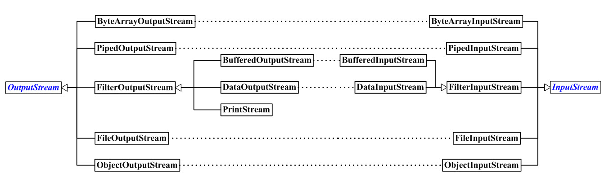

# InputStream 和 OutputStream


**InputStream** **函数列表**  

```java
             int     available()
             void    close()
             void    mark(int readlimit)
             boolean markSupported()
             int     read(byte[] buffer)
abstract     int     read()
             int     read(byte[] buffer, int offset, int length)
synchronized void    reset()
             long    skip(long byteCount)
```

**OutputStream** **函数列表**  

```java
         void    close()
         void    flush()
         void    write(byte[] buffer, int offset, int count)
         void    write(byte[] buffer)
abstract void    write(int oneByte)
```

## InputStream.java 源码分析

InputStream 是以字节为单位的**输入流**的超类。InputStream提供了read()接口从输入流中读取字节数据。

```java

package java.io;

public abstract class InputStream implements Closeable {

    // 能skip的大小
    private static final int MAX_SKIP_BUFFER_SIZE = 2048;

    // 从输入流中读取数据的下一个字节。
    public abstract int read() throws IOException;

    // 将数据从输入流读入 byte 数组。
    public int read(byte b[]) throws IOException {
        return read(b, 0, b.length);
    }

    // 将最多 len 个数据字节从此输入流读入 byte 数组。
    public int read(byte b[], int off, int len) throws IOException {
        if (b == null) {
            throw new NullPointerException();
        } else if (off < 0 || len < 0 || len > b.length - off) {
            throw new IndexOutOfBoundsException();
        } else if (len == 0) {
            return 0;
        }
        int c = read();
        if (c == -1) {
            return -1;
        }
        b[off] = (byte)c;
        int i = 1;
        try {
            for (; i < len ; i++) {
                c = read();
                if (c == -1) {
                    break;
                }
                b[off + i] = (byte)c;
            }
        } catch (IOException ee) {
        }
        return i;
    }

    // 跳过输入流中的n个字节
    public long skip(long n) throws IOException {
        long remaining = n;
        int nr;
        if (n <= 0) {
            return 0;
        }
        int size = (int)Math.min(MAX_SKIP_BUFFER_SIZE, remaining);
        byte[] skipBuffer = new byte[size];
        while (remaining > 0) {
            nr = read(skipBuffer, 0, (int)Math.min(size, remaining));
            if (nr < 0) {
                break;
            }
            remaining -= nr;
        }
        return n - remaining;
    }

    public int available() throws IOException {
        return 0;
    }

    public void close() throws IOException {}

    public synchronized void mark(int readlimit) {}

    public synchronized void reset() throws IOException {
        throw new IOException("mark/reset not supported");
    }

    public boolean markSupported() {
        return false;
    }
}
```

## OutputStream.java 源码分析
OutputStream 是以字节为单位的**输出流**的超类。OutputStream提供了write()接口从输出流中读取字节数据。

```java
package java.io;

public abstract class OutputStream implements Closeable, Flushable {
    // 将字节b写入到“输出流”中。
    // 它在子类中实现！
    public abstract void write(int b) throws IOException;

    // 写入字节数组b到“字节数组输出流”中。
    public void write(byte b[]) throws IOException {
        write(b, 0, b.length);
    }

    // 写入字节数组b到“字节数组输出流”中，并且off是“数组b的起始位置”，len是写入的长度
    public void write(byte b[], int off, int len) throws IOException {
        if (b == null) {
            throw new NullPointerException();
        } else if ((off < 0) || (off > b.length) || (len < 0) ||
                   ((off + len) > b.length) || ((off + len) < 0)) {
            throw new IndexOutOfBoundsException();
        } else if (len == 0) {
            return;
        }
        for (int i = 0 ; i < len ; i++) {
            write(b[off + i]);
        }
    }

    public void flush() throws IOException {
    }

    public void close() throws IOException {
    }
}
```